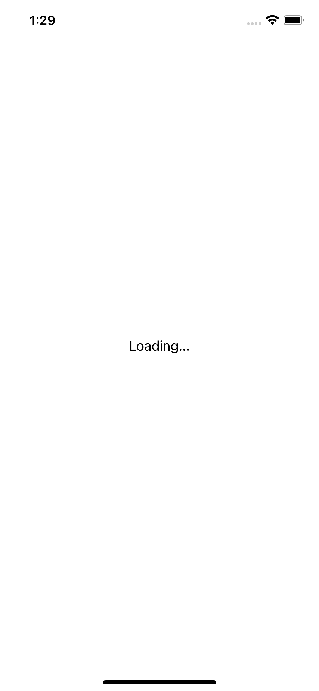

# Swinject Pattern Example with OpenWeatherMap API

This is a sample iOS application that demonstrates the use of the Swinject Pattern to manage dependencies and consume the OpenWeatherMap API to display the current weather information for a given location.

## Overview
The application is a simple weather app that displays the current weather conditions for a specified location.

The app is built using the Swinject Pattern, which provides a lightweight and easy-to-use dependency injection framework for iOS applications. 

## Installation
To install the app, follow these steps:

Clone the repository to your local machine.
Open the project in Xcode.
Build and run the app on a simulator or a physical device running iOS 15 or later.
Note: You will need to obtain a free API key from the [OpenWeatherMap website](https://openweathermap.org/) to use this app. Once you have the API key, add it to the Debug_Api_Info.plist and Prod_Api_Info.plist to run in both build options.

In the first version, the name of the city is harcoded, as the main goal of this app is to use swinject and not make a friendly interface. You can change the city name in the WeatherViewController, or search for the string "Curitiba".

## Result

  
  

